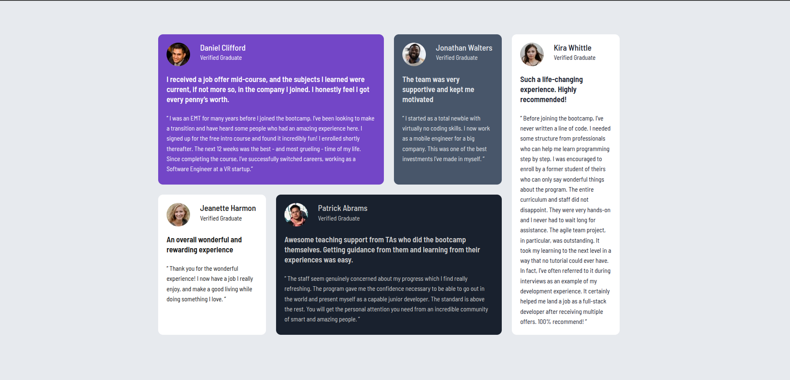

# Frontend Mentor - Testimonials grid section solution

This is a solution to the [Testimonials grid section challenge on Frontend Mentor](https://www.frontendmentor.io/challenges/testimonials-grid-section-Nnw6J7Un7). Frontend Mentor challenges help you improve your coding skills by building realistic projects.

## Table of contents

- [Overview](#overview)
  - [The challenge](#the-challenge)
  - [Screenshot](#screenshot)
  - [Links](#links)
- [My process](#my-process)
  - [Built with](#built-with)
  - [What I learned](#what-i-learned)

## Overview

### The challenge

Users should be able to:

- View the optimal layout for the site depending on their device's screen size

### Screenshot

### Links

- Solution URL: https://github.com/apsbundela/frm-testimonials-grid-section-card
- Live Site URL: 

## My process

### Built with

- Semantic HTML5 markup
- Flexbox
- CSS Grid
- Mobile-first workflow

### What I learned

#### Centering the grid container

- Initially, the testimonial grid was taking the full screen width on desktop.
- I learned that to center a grid layout properly, it is important to give the grid container a `max-width` so it knows when to stop growing.
- Without a `max-width`, the container naturally expands to fill the entire viewport.
- I learned that using `margin-left: auto` and `margin-right: auto` centers a block-level element horizontally.
- I also learned that `margin-inline: auto` is a cleaner and more modern alternative for horizontal centering.

#### Understanding vertical scrolling and card height

- At first, I assumed the cards were growing vertically due to a grid or layout issue.
- I learned that the real cause was typography, not CSS Grid.
- Larger `font-size`, improper `line-height`, and excessive `padding` were increasing the card height.
- After adjusting these typography values, the cards matched the design proportions more closely.
- I also learned that vertical scrolling is content-driven and is completely normal, especially on smaller viewport heights.

For more help with writing Markdown, check out [The Markdown Guide](https://www.markdownguide.org/).
